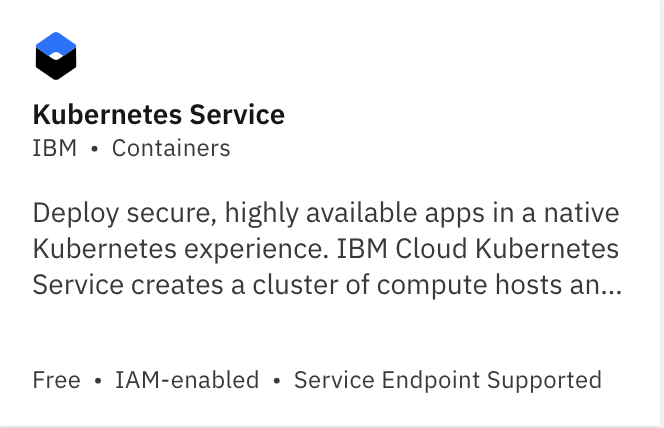

# Installing developer tools and environments

In this section you will build your local development environment as well as the IBM Cloud infrastructure for deploying your application.
You will start by creating an IBM Cloud account and requesting an instance of a free trial Kubernetes cluster.
Later you will create a Github account and configure your local `git` client.
The next steps involve the installation of several software development tools such as `ibmcloud` CLI, Docker, Kubernetes and Visual Studio Code, that will assist you in your journey towards your first cloud-based Python application.

## Setting up IBM Cloud environment

1. Log in to [IBM Cloud](https://cloud.ibm.com/).
    * *Note*: If you do not have an account, [Create an IBM Cloud account](https://cloud.ibm.com/registration) using your email address.
1. Click **Create resource +** in the top right.
1. Open the **Services** menu on the left, then select the **Containers** category and click the **Kubernetes Service** card. 
1. In the **Kubernetes Cluster** page, select the **Free** plan and **default** resource group.
1. Name your cluster as **`username`-cluster** and click **Create**.
1. In the **Overview** tab on the left, watch as your cluster is deployed. It may take _several tens of minutes_ until the **Normal** status is reached.

## Setting up GitHub environment

1. Log in to [GitHub](https://github.com/).
    * *Note*: If you do not have an account, [Sign up for free](https://github.com/join) using your email address.
1. Update your [profile page](https://github.com/settings/profile).
1. Install a Git client
    * macOS: Download [GitHub Desktop Client](https://desktop.github.com) or `brew cask install github`.
    * Windows: Download [GitHub Desktop Client](https://desktop.github.com).
    * Fedora: `sudo dnf install git`.
1. (macOS and Windows): Follow the [instructions](https://help.github.com/desktop/guides/getting-started-with-github-desktop/authenticating-to-github/) and setup GitHub Desktop.
    * *Note to Windows users*: In case Firefox cannot handle the operation, copy and paste the URL into a different browser.
1. Define your Git identification credentials according to your [profile page](https://github.com/settings/profile).
    * macOS and Windows: Under **Preferences / Options**, go to the **Git** tab and fill in your **Name** and **Email** address.
    * Fedora: Open a terminal and enter

        ```Shell
        git config --global user.name "Your Name"
        git config --global user.email "your@email.com"
        ```

1. (macOS) Click the **GitHub Desktop** menu and select **Install Command Line Tool...**.
1. Follow [these instructions](https://help.github.com/en/articles/generating-a-new-ssh-key-and-adding-it-to-the-ssh-agent) to generate an SSH key.
1. Add the SSH key to your GitHub profile according to the [instructions](https://help.github.com/en/articles/adding-a-new-ssh-key-to-your-github-account).

## Installing IBM Cloud CLI

1. Go to the [IBM Cloud CLI download page](https://cloud.ibm.com/docs/cli/reference/ibmcloud/download_cli.html#shell_install).
1. Choose the install command according to your operational system and follow the instructions.
    * *Note to macOS users*: You can also do `brew cask install ibm-cloud-cli`.
    * *Note to Windows users*: A reboot may be required after installing IBM Cloud CLI.
1. Install IBM Cloud CLI plugins.
    * IBM Cloud Developer Tools: `ibmcloud plugin install dev`.
    * IBM Cloud Container Service: `ibmcloud plugin install kubernetes-service`.
    * IBM Cloud Container Registry: `ibmcloud plugin install container-registry`.
1. In a terminal window, enter `ibmcloud --version` to check the installation.
1. In a terminal window, enter `ibmcloud plugin list` to check the plugins.

## Installing Docker Community Edition

1. Go to the Docker Store and follow the instructions according to your operational system
    * Fedora: [Get Docker CE for Fedora](https://docs.docker.com/install/linux/docker-ce/fedora/).
    * Windows: [Install Docker Desktop for Windows](https://docs.docker.com/docker-for-windows/install/).
    * macOS: [Install Docker Desktop for Mac](https://docs.docker.com/docker-for-mac/install/) or `brew cask install docker`.
1. (Windows) [Virtualisation](https://docs.docker.com/docker-for-windows/troubleshoot/#virtualization-must-be-enabled) must be enabled in the BIOS. Go to **Security**, then **Virtualization** and enable both.
1. In a terminal window, enter `docker --version` to check the installation.

## Installing Kubernetes client

1. Go to the [Install and Set Up `kubectl`](https://kubernetes.io/docs/tasks/tools/install-kubectl/) page and follow the instructions appropriate to your operational system.
    * *Note to macOS users*: You can also do `brew install kubernetes-cli`.
    * *Note to Fedora users*: You can also do `sudo dnf install kubernetes`.
    * *Note to Windows users*: To add the folder containing [`kubectl.exe`](https://kubernetes.io/docs/tasks/tools/install-kubectl/#install-kubectl-on-windows) to the system `PATH`, follow these [command-line](https://www.windows-commandline.com/set-path-command-line/) or [graphical interface](http://www.itprotoday.com/management-mobility/how-can-i-add-new-folder-my-system-path) instructions.
1. In a terminal window, enter `kubectl version` to check the installation.

## Installing Visual Studio Code

1. Go to [Visual Studio Code download page](https://code.visualstudio.com/Download).
1. Choose the installer according to your operational system and follow the instructions.
    * *Note to macOS users*: You can also do `brew cask install visual-studio-code`.
    * *Note to Fedora users*: You can find detailed instructions [here](https://code.visualstudio.com/docs/setup/linux#_rhel-fedora-and-centos-based-distributions).
1. Open VS Code and install extensions
    * Python: [click "Install"](https://marketplace.visualstudio.com/items?itemName=ms-python.python) or hit `Ctrl + P` and enter `ext install ms-python.python`.
    * IBM Developer Tools: [click "Install"](https://marketplace.visualstudio.com/items?itemName=IBM.ibm-developer) or hit `Ctrl + P` and enter `ext install IBM.ibm-developer`.
    * Output Colorizer: [click "Install"](https://marketplace.visualstudio.com/items?itemName=IBM.output-colorizer) or hit `Ctrl + P` and enter `ext install IBM.output-colorizer`.
    * Docker: [click "Install"](https://marketplace.visualstudio.com/items?itemName=PeterJausovec.vscode-docker) or hit `Ctrl + P` and enter `ext install PeterJausovec.vscode-docker`.
    * Kubernetes: [click "Install"](https://marketplace.visualstudio.com/items?itemName=ms-kubernetes-tools.vscode-kubernetes-tools) or hit `Ctrl + P` and enter `ext install ms-kubernetes-tools.vscode-kubernetes-tools`.
