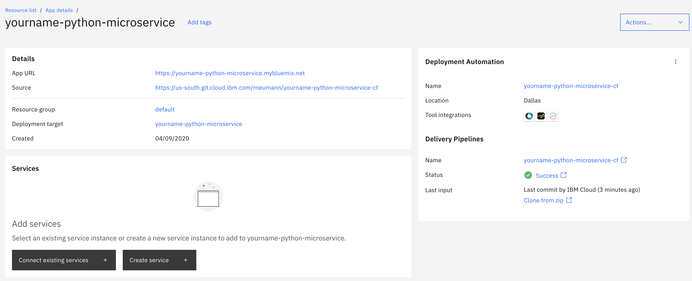

# Configuring DevOps tools

In this section, you will create a Python Flask starter kit and link it to a Github repository.
Later will you configure a Continuous Delivery Pipline that will track the repository and redeploy your application at every `git push`.

## Creating a Python Starter Kit

1. Log in to [IBM Cloud](https://cloud.ibm.com/).
1. Click **Create resource +** in the top right corner.
1. Open the **Software** menu on the left, then check the **Developer Tools** and **Starter Kits** filter boxes.
1. Select the **Python Flask App** card. 
1. In the next page, click **Get started**.
1. Name it **`username`-python-microservice** and, leaving everything else untouched, hit **Create**.

## Creating GitHub repository

1. Log in to [IBM Cloud](https://cloud.ibm.com/).
1. Click **`username`-python-microservice** in the **Apps** link on the **Resource summary** panel.
1. In the **Deployment Automation** card, click the **Deploy your app** button to configure the Continuous Delivery feature.
1. In the **Select the deployment target** panel, pick **Cloud Foundry**.
1. Click the **New +** button to generate a new **IBM Cloud API key** and click **OK** in the pop-up window. Click **Next** at the bottom of the screen.
1. In the **Configure the DevOps toolchain** panel, name the toolchain as **`username`-python-microservice-cf** (where `cf` refers to "Cloud Foundry") and click **Create**.
1. Wait until the Delivery Pipeline **Status** moves from *In progress* to *Success*.
    * *Note:* You might need to refresh your browser window so that it shows the **App URL**. 
1. In the **Details** card, copy the **Source** URL.
1. In the **Deployment Automation** card, open the link containing the **Name** of your Continuous Delivery service.
1. On the top right corner, click **Add tool** and choose **GitHub** from the **Version Control** category in the catalog.
1. Authorise access from IBM Cloud to your GitHub account by checking the **"I understand"** box.
1. Under **Repository type**, choose **Clone** from the menu.
1. Paste the **Source** URL you copied to **Source repository URL**.
1. Choose your own username as **Owner** and name the repository as **`username`-python-microservice**.
    * *Note:* The default **Repository Name** will contain an unwanted `-cf` suffix. Please consider removing it.
1. Make sure the **Enable GitHub Issues** and **Track deployment of code changes** boxes are checked.
1. Click **Create Integration**.

## Configuring Continuous Delivery Pipeline

1. Log in to [IBM Cloud](https://cloud.ibm.com/).
1. Click **`username`-python-microservice** in the **Apps** link on the **Resource summary** panel.
1. In the **Deployment Automation** card, click the name of your **Delivery Pipeline**.
1. In the next screen, click the gear icon in the **Build Stage** card and then **Configure Stage**.
1. In the **Input** tab, choose the option in **Git repository** that leads to Github as **Git URL**.
1. Save your work and run the **Build Stage** by clicking the :arrow_forward: icon.
1. Watch as the **Build Stage** completes and triggers the **Deploy Stage**.
