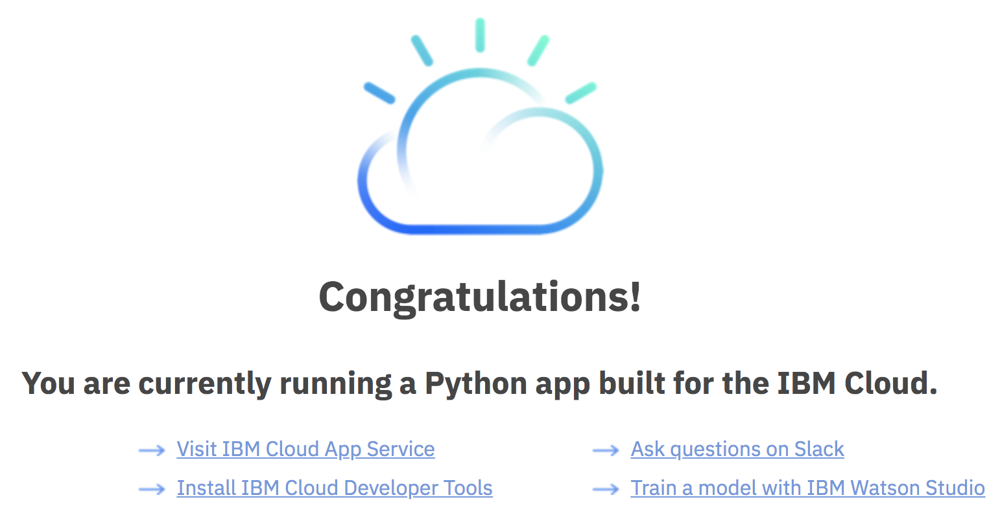

# Playing with your Python application

In this section, you will clone the repository to your local machine and become familiar with the structure of the application.
After that you will add two new simple API calls to your application.

## Cloning the repository

1. Log in to [GitHub](https://github.com/).
1. Choose **`username`-python-microservice** from the **Repositories** menu on the left.
1. Click the green button **Clone or download** and copy the address starting with `git@github.com`.
1. Open **Visual Studio Code** and summon the **Command Palette** with
    * `Ctrl + Shift + P` in [Fedora](https://code.visualstudio.com/shortcuts/keyboard-shortcuts-linux.pdf)
    * `Ctrl + Shift + P` in [Windows](https://code.visualstudio.com/shortcuts/keyboard-shortcuts-windows.pdf)
    * `Cmd + Shift + P` in [macOS](https://code.visualstudio.com/shortcuts/keyboard-shortcuts-macos.pdf)
1. Type `clone` and select **Git: Clone** from the list.
1. Paste the `git@github.com` address you copied before and provide the destination as required.
1. Open the newly cloned repository.

## Testing the example implementation

1. Open the **`username`-python-microservice** repository in Visual Studio Code.
1. Open the `server/routes/index.py` file.
1. Read the `@app.route('/')` code block.
1. Go to <http://username-python-microservice.mybluemix.net/> and observe the response. 
1. Read the `@app.route('/error404')` code block.
1. Go to <http://username-python-microservice.mybluemix.net/error404> and observe the response.
1. Open the `server/routes/health.py` file.
1. Read the `@app.route('/health')` code block.
1. Go to <http://username-python-microservice.mybluemix.net/health> and observe the response.
1. Open the `server/routes/swagger.py` file.
1. Read the `@app.route('/swagger/api')` code block.
1. Go to <http://username-python-microservice.mybluemix.net/swagger/api> and observe the response.
1. Read the `@app.route('/explorer')` code block.
1. Go to <http://username-python-microservice.mybluemix.net/explorer> and observe the response.
1. Click the `/health` endpoint and the **Try it out!** button.

## Customizing the example implementation

1. Open the **`username`-python-microservice** repository in Visual Studio Code.
1. Open the `health.py` file.
1. Add the following code block and save the modifications.
    ```Python
    @app.route('/answer')
    def answer():
        answer = {'The Answer to Life the Universe and Everything': 42}
        return jsonify(answer)
    ```
1. Open the **Source Control** panel in the left corner.
1. Click the `+` icon next to `health.py` to **Stage Changes**.
1. Write a meaningful commit message, such as `Created '/answer' endpoint` and click the `√` icon.
1. On the bottom left corner, click the :arrows_counterclockwise: icon to **Synchronize Changes**.
1. Track the deployment progress in the **Continuous Delivery Pipeline** until the **Deploy Stage** passes.
1. Go to <http://username-python-microservice.mybluemix.net/answer> and observe the response.

## Customizing the example implementation again

1. Open the **`username`-python-microservice** repository in Visual Studio Code.
1. Open the `health.py` file.
1. Add the following code block to `health.py` and save the modifications.
    ```Python
    @app.route('/answer/<number>')
    def CheckAnswerToLifeTheUniverseAndEverything(number):
        content = {
            'statement': 'The Answer to Life the Universe and Everything is ' + number + '.',
            'check': 'The statement is ' + str(number == '42') + '!'
        }
        return jsonify(content)
    ```
1. Open the **Source Control** panel in the left corner.
1. Click the `+` icon next to `health.py` to **Stage Changes**.
1. Write a meaningful commit message, such as `Created '/answer/<number>' endpoint` and click the `√` icon.
1. On the bottom left corner, click the :arrows_counterclockwise: icon to **Synchronize Changes**.
1. Track the deployment progress in the **Continuous Delivery Pipeline**.
1. Go to <http://username-python-microservice.mybluemix.net/answer/42> and observe the response.
1. Go to <http://username-python-microservice.mybluemix.net/answer/24> and observe the response.
