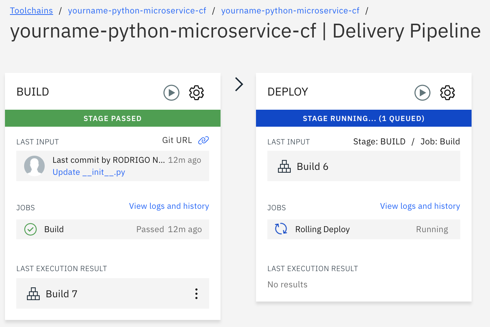

# Developing a number-crunching application

In this section, you will use a new Python library that automatically generates Swagger API documentation from your source code.
Later you will add new services and routes to your application, adding new number-crunching features to the cloud-based API.

## Generating a Swagger API documentation

1. Open the **`username`-python-microservice** repository in Visual Studio Code.
1. Install the latest [**Flask-RESTX**](https://flask-restx.readthedocs.io/) by
    * Adding `flask-restx = "*"` to the bottom of `Pipfile`.
1. Delete the `Pipfile.lock` file to force `pipenv` to read your modified `Pipfile`.
1. Open the `server/__init__.py` file, perform the following modifications and save your work.
    * Add `from flask_restx import Api` to the `import` list at the top of the file.
    * Add the following line below the definition of the `app` object in line 6.
        ```Python
        api = Api(app, title='My first Python API', version='1.0', doc='/apidocs/', description='A number-crunching API')
        ```
1. Create a new `math.py` file in `server/routes/` with the code shown below.
    ```Python
    from server import api
    from flask import jsonify
    from flask_restx import Resource

    @api.route('/double/<int:number>')
    @api.doc(params={'number': 'Number to be doubled.'}, description='This method doubles the input.')
    class DoubleNumber(Resource):
        def get(self, number):
            return jsonify(result=2 * number)
    ```
1. Commit your changes to the `Pipfile`, `server/__init__.py` and `math.py` files.
1. Sync your commits with the GitHub repository.
1. Track the deployment progress in the **Continuous Delivery Pipeline**.

## Exploring the Swagger API documentation

1. Go to <http://username-python-microservice.mybluemix.net/apidocs/>.
1. Observe how the header in the top reflects the line recently added to `server/__init__.py`.
1. Click on the **Default namespace** and the `/double/{number}` endpoint.
1. Observe how the blue card reflects the contents of `server/routes/math.py`.
1. Try to guess from the documentation the **purpose** and **data input format** of this method.
1. Click **Try it out**, enter an input in the text box and hit **Execute**.
1. Try several values for the `required` field and observe the response.
    * A string: `word`
    * A symbol: `+`
    * A floating point number: `1.5`
    * An integer number: `42`
1. Go to <http://username-python-microservice.mybluemix.net/double/42> and observe the response.

## Creating number-crunching services

1. Open the **`username`-python-microservice** repository in Visual Studio Code.
1. Install the latest [**NumPy**](http://www.numpy.org) by
    * Adding `numpy = "*"` to the bottom of `Pipfile`.
1. Create a new file inside `server/services/` and name it `math_services.py`.
1. Start `math_services.py` by importing the Python module you have just added to `Pipfile`.
    ```Python
    import numpy as np
    ```
1. Implement a service that converts a string with comma-separated integer values to a Python list of integers.
    * *Hint*: copy `csv_to_list()` from [`app/math_services.py`](app/math_services.py#L4-L21).
1. Implement a service that converts a list of integer values to an integer NumPy array.
    * *Hint*: copy `list_to_array()` from [`app/math_services.py`](app/math_services.py#L24-L40).
1. Implement a service that calculates the mean of a list of integer values.
    * *Hint*: copy `calculate_mean()` from [`app/math_services.py`](app/math_services.py#L43-L60).
1. Commit your changes to the `Pipfile` and `math_services.py` files.
1. Sync your commits with the GitHub repository.
1. Track the deployment progress in the **Continuous Delivery Pipeline**.

## Configuring Python deployment environment

1. Open the **`username`-python-microservice** repository in Visual Studio Code.
1. Create a new file in the main repository directory named `runtime.txt` by clicking the **New File** button.
1. Check the latest Python buildpack version [available at IBM Cloud](https://cloud.ibm.com/docs/runtimes/python/index.html).
1. Add `python-X.Y.Z` to `runtime.txt` reflecting the latest available version.
    * *Example*: `python-3.6.4`
1. Commit your changes to the `runtime.txt` file.
1. Sync your commits with the GitHub repository.
1. Track the deployment progress in the **Continuous Delivery Pipeline**.

## Linking number-crunching services to API resources

1. Open the **`username`-python-microservice** repository in Visual Studio Code.
1. Open `math.py` and remove the `@api.route('/double/<int:number>')` code block.
1. Add `from server.services import math_services as ms` to the import list at the top of the file.
1. Add below `my_list = list()` to create an empty Python list.
1. Create an API method that **prints** the content of the list.
    * *Hint*: copy [lines 9-13 from `app/custom-math.py`](app/custom-math.py#L9-L13).
1. Create an API method that **resets** the content of the list.
    * *Hint*: copy [lines 16-21 in `app/custom-math.py`](app/custom-math.py#L16-L21).
1. Create an API method that **reverses** the content of the list.
    * *Hint*: copy [lines 24-29 in `app/custom-math.py`](app/custom-math.py#L24-L29).
1. Create an API method that **sorts** the content of the list.
    * *Hint*: copy [lines 32-37 in `app/custom-math.py`](app/custom-math.py#L32-L37).
1. Create an API method that **extends** the content of the list.
    * *Hint*: copy [lines 40-46 in `app/custom-math.py`](app/custom-math.py#L40-L46).
1. Create an API method that **replaces** the content of the list.
    * *Hint*: copy [lines 49-56 in `app/custom-math.py`](app/custom-math.py#L49-L56).
1. Create an API method that **calculates the mean** of the content of the list.
    * *Hint*: copy [lines 59-64 in `app/custom-math.py`](app/custom-math.py#L59-L64).
1. Place your mouse cursor over `csv_to_list()` and `calculate_mean()` to read the documentation.
1. In the end, your file should look like [`app/custom-math.py`](app/custom-math.py).
1. Commit your changes to the `math.py` file.
1. Sync your commits with the GitHub repository.
1. Track the deployment progress in the **Continuous Delivery Pipeline**. 
