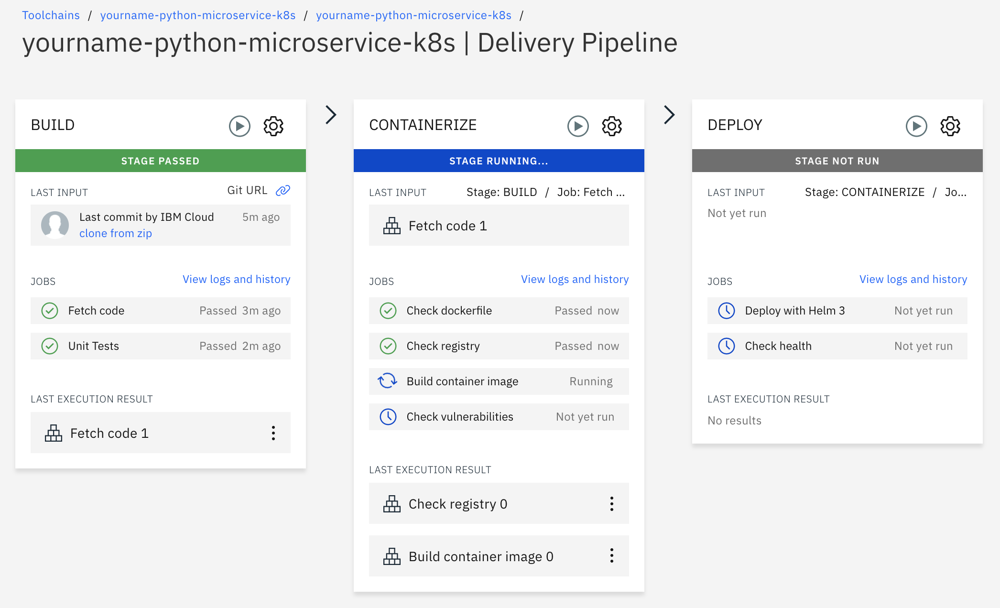

# Containerising the Python application

In this section, you will replace the Cloud Foundry-based delivery pipeline by one that uses Kubernetes as deployment strategy.
You will create a configure the new Kubernetes-based pipeline and, optionally, learn how to perform the Kubernetes deployment manually.

## Setting up a private registry namespace

1. Log in to [IBM Cloud](https://cloud.ibm.com/).
1. In the top left corner, click the three horizontal lines to open the IBM Cloud menu.
1. Select **Kubernetes** from the menu.
1. In the **Registry** tab, click the **Namespaces** card.
1. Hit the **Create +** button in the right side.
1. In the **Create namespace** screen, use your **`username`** as name.
1. Click the **Create** button.

## Creating a new Kubernetes-based toolchain

1. Log in to [IBM Cloud](https://cloud.ibm.com/).
1. Click **`username`-python-microservice** in the **Apps** link on the **Resource summary** panel.
1. Click **Disconnect toolchain** in the top right corner of the **Deployment Automation** card to remove the old Cloud Foundry-based toolchain.
1. Then click the **Deploy your app** button to re-enable the Continuous Delivery feature.
1. In the **Choose a deployment environment** panel, pick **Deploy to Kubernetes** and hit **Next**.
1. In the **Configure toolchain** panel, name the toolchain as **`username`-python-microservice-k8s** (where `k8s` refers to "Kubernetes") and click **Create**.
1. In the **Deployment Automation** card, click the name of your toolchain.
1. On the top right, click **Add a Tool** and choose **GitHub** from the catalog.
1. Authorise access from IBM Cloud to your GitHub account by clicking the **Authorize** button.
1. Under **Repository type**, choose **Link** from the menu.
1. Select the **`username`-python-microservice** repository from the **Repository URL** menu.
1. Make sure the **Enable GitHub Issues** and **Track deployment of code changes** boxes are checked.
1. Click **Create Integration**.

## Deploying a container with Continuous Delivery Pipeline

1. Log in to [IBM Cloud](https://cloud.ibm.com/).
1. Click **`username`-python-microservice** in the **Apps** link on the **Resource summary** panel.
1. In the **Deployment Automation** card, click the name of your **Delivery Pipeline**.
1. In the next screen, click the gear icon in the **Build Stage** card and then **Configure Stage**.
1. In the **Input** tab, choose the option in **Git repository** that leads to Github as **Git URL**.
1. Save your changes and run the **Build Stage** by clicking the :arrow_forward: icon. 

## Accessing the containerised application

1. Log in to [IBM Cloud](https://cloud.ibm.com/).
1. Click **`username`-python-microservice** in the **Apps** link on the **Resource summary** panel.
1. In the **Deployment Automation** card, click the name of your **Delivery Pipeline**.
1. Track the progress of your latest commit from the **Build Stage** to the **Deploy Stage**.
1. Click the **View logs and history** link in the **Deploy Stage** card.
1. After a successful deploy, at the very bottom of the page, you will find a link like <http://IP_ADRESS:PORT>.
1. Click the link and add `/apidocs/` to the URL in order to open the Swagger API documentation.

## Deploying a container manually using the command-line

1. Open **Visual Studio Code** and summon the **Command Palette** with
    * `Ctrl + Shift + P` in [Fedora](https://code.visualstudio.com/shortcuts/keyboard-shortcuts-linux.pdf)
    * `Ctrl + Shift + P` in [Windows](https://code.visualstudio.com/shortcuts/keyboard-shortcuts-windows.pdf)
    * `Cmd + Shift + P` in [macOS](https://code.visualstudio.com/shortcuts/keyboard-shortcuts-macos.pdf)
1. Type `terminal` and choose **View: Toggle Integrated Terminal**.
1. In the terminal window, issue `ibmcloud login --sso` and follow the on-screen instructions to log in to IBM Cloud.
1. Execute `ibmcloud ks init`, then `ibmcloud cr login`. If the second command fails, make sure **Docker** is running locally.
1. Configure your Kubernetes cluster by executing the command
    ```Shell
    ibmcloud ks cluster config --cluster <username>-cluster
    ```
1. Create a Kubernetes namespace.
    ```Shell
    kubectl create namespace <username>
    ```
1. Configure your `kubectl` environment.
    ```Shell
    kubectl config set-context <username>-cluster --cluster=<username>-cluster --namespace=<username>
    ```
1. Export your image registry secrets.
    ```Shell
    kubectl get secret bluemix-default-secret-regional -n default -o yaml | sed 's/default/<username>/g' | kubectl create -f -
    kubectl get secret bluemix-default-secret-international -n default -o yaml | sed 's/default/<username>/g' | kubectl create -f -
    ```
1. Take note of the **Repository** URL and image **Tag** number in the output of `ibmcloud cr images`.
1. Create a **Pod** based on your image and expose it with a **NodePort** service.
    ```Shell
    kubectl run <username>-python-microservice --image=<repository>:<tag> --restart=Never --image-pull-policy=Always --overrides='{ "apiVersion": "v1", "spec": { "imagePullSecrets": [{"name": "bluemix-<username>-secret-regional"}] } }'
    kubectl expose pod <username>-python-microservice --port=3000 --type=NodePort --name=<username>-python-microservice
    ```
1. Take note of the **Public IP** from the output of `ibmcloud ks workers --cluster <username>-cluster`.
1. Take note of the secondary **Port** number (after the `:`) in the output of `kubectl get all`.
1. Open a browser window and access `<http://PUBLIC_IP:PORT/apidocs/>`.
